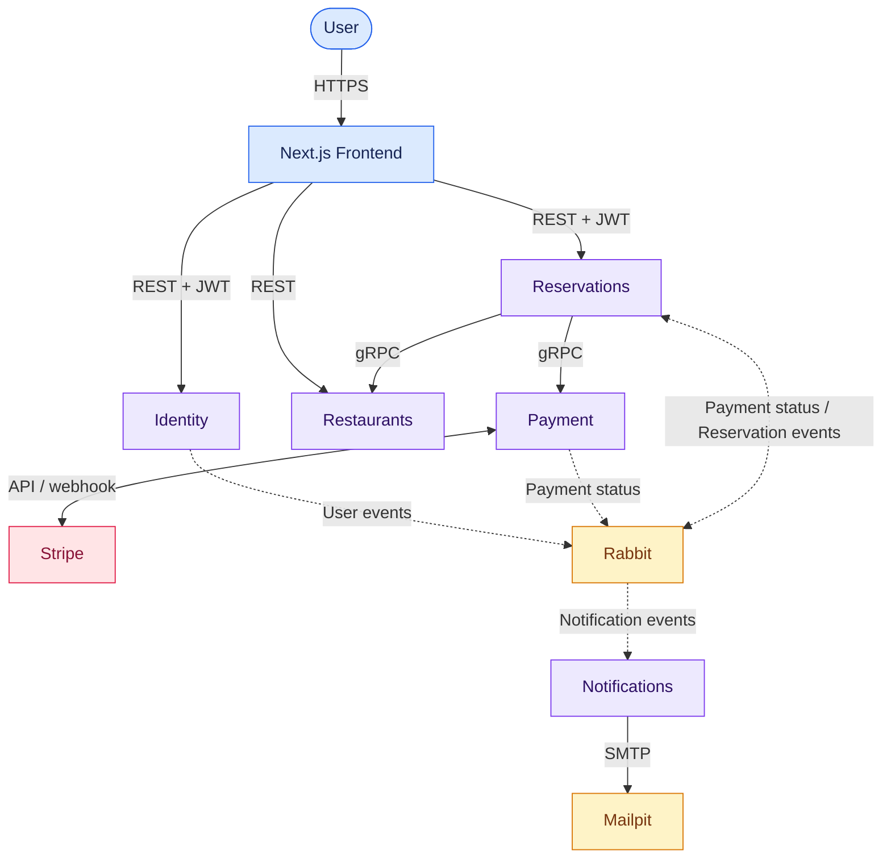

# ReserveNServe

ReserveNServe is a restaurant reservation and food pre-ordering platform built with a microservices architecture.

Users can browse restaurants, check table availability, create and manage reservations, pre-order food and drinks, pay online with Stripe and receive email notifications.

[Watch the application demo on Google Drive](https://drive.google.com/file/d/1f9OtN2Ei8Sn2Zv23GxueeDzQf7xu-zhz/view?usp=drive_link).

## Main Features

- User registration, email confirmation, authentication and password reset
- Role-based authorization for users, restaurant owners and administrators
- Restaurant, cuisine, menu, table and table-group management
- Availability search and reservation management
- Food and drink pre-ordering
- Stripe payments, webhooks and refunds
- Transactional email notifications
- Unit and end-to-end tests

## Architecture

The application consists of a Next.js frontend and five ASP.NET Core microservices. Services communicate synchronously through REST and gRPC and asynchronously through RabbitMQ.



See the [architecture documentation](docs/architecture.md) for service communication, events, data ownership and runtime flows.

### Services

| Component | Responsibility | Documentation |
| --- | --- | --- |
| Frontend | User interface, authentication state, reservations, pre-orders and Stripe Elements | [Frontend README](frontend/README.md) |
| Identity.API | Users, authentication, JWT tokens, roles and owner requests | [Identity README](backend/ReserveNServeBackend/Services/Identity/README.md) |
| Restaurants.API | Restaurants, cuisines, menus, opening hours, tables and table groups | [Restaurants README](backend/ReserveNServeBackend/Services/Restaurants/README.md) |
| Reservations.API | Availability, reservations, pre-orders and payment-state coordination | [Reservations README](backend/ReserveNServeBackend/Services/Reservations/README.md) |
| Payment.API | Stripe PaymentIntents, webhooks, payment status and refunds | [Payment README](backend/ReserveNServeBackend/Services/Payment/README.md) |
| Notifications.API | RabbitMQ event consumption and transactional email delivery | [Notifications README](backend/ReserveNServeBackend/Services/Notifications/README.md) |

## Technology Stack

| Area | Technology |
| --- | --- |
| Frontend | Next.js 16, React 19, TypeScript, Tailwind CSS |
| Backend | ASP.NET Core, .NET 10 |
| Authentication | ASP.NET Core Identity, JWT |
| Data access | Entity Framework Core |
| Databases | Microsoft SQL Server 2022, PostgreSQL 17 |
| Internal communication | gRPC |
| Messaging | RabbitMQ |
| Payments | Stripe |
| Email | MailKit, SMTP, Mailpit |
| API documentation | Swagger / OpenAPI |
| Testing | xUnit, Moq |
| Containerization | Docker, Docker Compose |

## Quick Start

### Prerequisites

- Git
- Docker Desktop or Docker Engine with Docker Compose
- Stripe test credentials

The .NET 10 SDK and Node.js are only required when running the backend or frontend outside Docker.

### 1. Clone the repository

```bash
git clone https://github.com/jelisavetagavrilovic/ReserveNServe.git
cd ReserveNServe/backend/ReserveNServeBackend
```

### 2. Configure the environment

```bash
cp .env.example .env
```

Set the required database, JWT, RabbitMQ, Stripe, and HTTPS certificate values in `.env`. Do not commit this file.

### 3. Create the development certificate

```bash
chmod +x scripts/setup-dev-cert.sh
./scripts/setup-dev-cert.sh
```

### 4. Start the application

```bash
docker compose up --build -d
docker compose ps
```

The first startup may take a few minutes while the databases are initialized.

To stop the application without removing local data:

```bash
docker compose down
```

For all configuration values, Stripe setup, certificate details and local-development options, see the [Setup and Run Guide](docs/setup-and-run.md).

## Local Endpoints

| Component | Address |
| --- | --- |
| Frontend | `http://localhost:3000` |
| Identity API | `http://localhost:5206` |
| Notifications API | `http://localhost:5200` |
| Restaurants API | `http://localhost:5174` / `https://localhost:7274` |
| Reservations API | `http://localhost:5040` / `https://localhost:7294` |
| Payment API | `http://localhost:5175` / `https://localhost:7275` |
| RabbitMQ Management | `http://localhost:15672` |
| Mailpit | `http://localhost:8025` |

Swagger/OpenAPI documentation is available through each API while the application is running in the Development environment.

## Testing

Run the backend test suite from `backend/ReserveNServeBackend`:

```bash
dotnet test ReserveNServeBackend.slnx
```

End-to-end tests require the relevant Docker services and Stripe test configuration.

## Documentation

| Document | Contents |
| --- | --- |
| [User Guide](docs/user-guide.md) | Registration, restaurant discovery, reservations, payments, cancellations and refunds |
| [Setup and Run Guide](docs/setup-and-run.md) | Complete configuration, Docker, certificates, Stripe, tests and troubleshooting |
| [Architecture](docs/architecture.md) | Service boundaries, communication, events, data ownership and sequence diagrams |
| [API Reference](docs/api-reference.md) | REST endpoints, authorization requirements and gRPC operations |
| [Class Diagrams](docs/class-diagrams.md) | Class diagrams for all backend subsystems and the frontend |

Each microservice and the frontend also have their own README containing subsystem-specific details.

## Security

Never commit `.env` files, database passwords, JWT signing keys, Stripe secret keys, webhook secrets, HTTPS certificates, or certificate passwords. Use development and test credentials when running the application locally.
