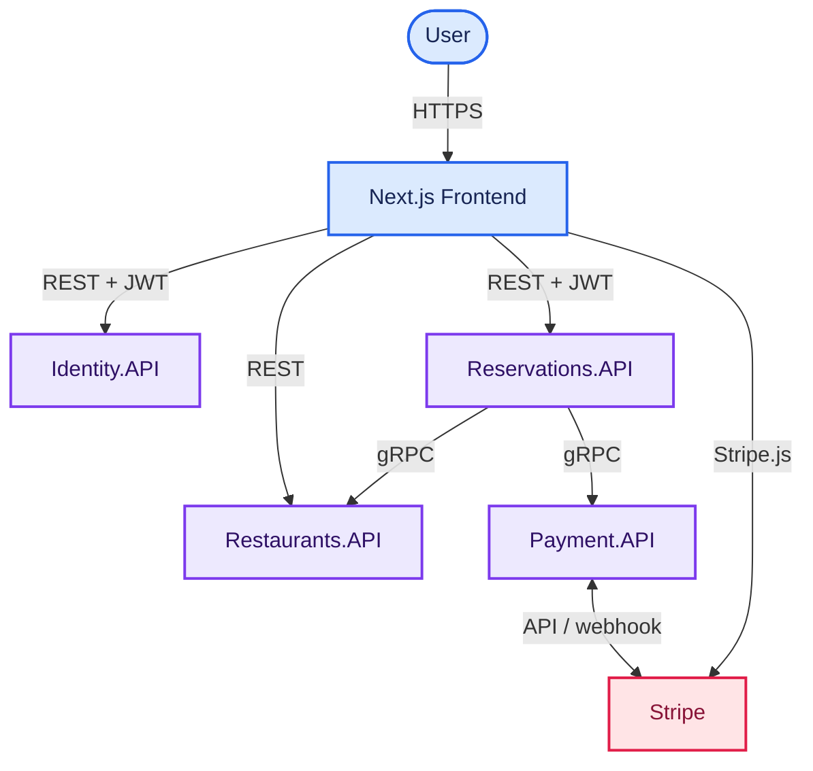
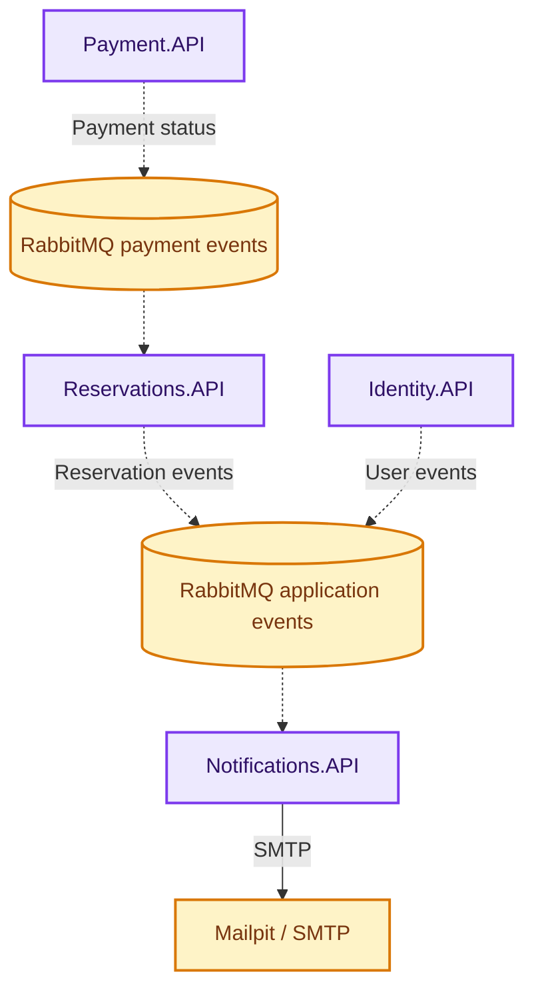
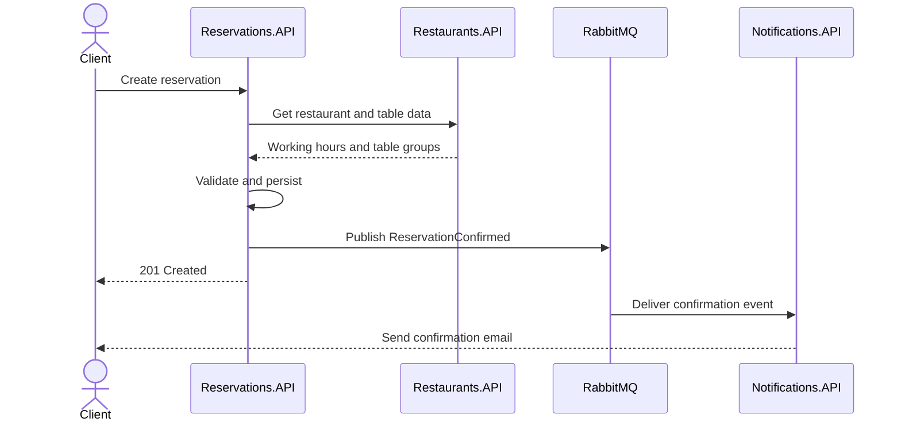
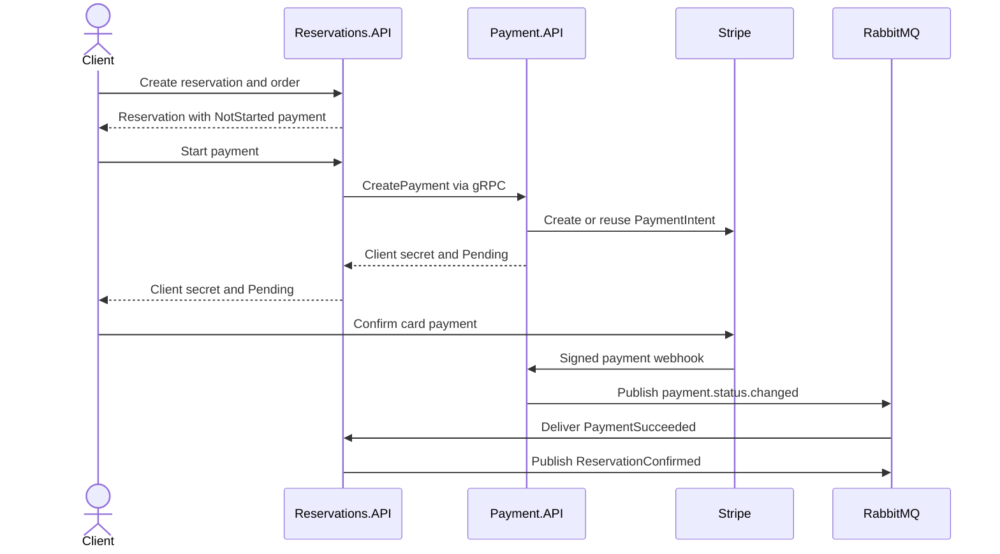
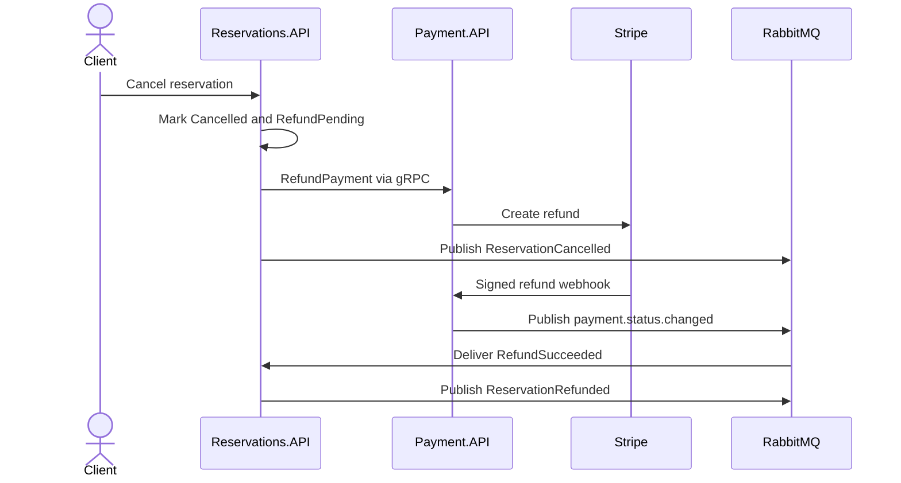

# ReserveNServe Architecture

ReserveNServe is a microservices application consisting of a Next.js frontend and five ASP.NET Core services. Services use REST and gRPC for synchronous communication, RabbitMQ for asynchronous events, Stripe for payments and SMTP for email delivery.

## System Overview

The diagrams separate request processing from event delivery.

### Request and Payment Flow

### Event and Email Flow

## Architectural Principles

- Each backend service owns a bounded responsibility and its own data.
- The browser accesses backend services through REST and uses Stripe.js for card confirmation.
- Reservations.API coordinates the booking use case and owns the user-visible reservation state.
- Restaurants.API and Payment.API expose gRPC operations to Reservations.API.
- RabbitMQ decouples status propagation and email delivery from request processing.
- Payment.API is the only service that interprets Stripe objects and signed webhooks.
- Notifications.API is the only service that renders and sends transactional email.
- Shared event contracts are stored in `BuildingBlocks/Contracts`; services do not share persistence models.

## Component Responsibilities

| Component | Primary responsibility | Owned state |
| --- | --- | --- |
| Next.js frontend | User journeys, authentication state, restaurant discovery, booking forms, Stripe Elements and status reconciliation | Browser session and temporary booking/cart state |
| Identity.API | Registration, confirmation, login, JWT and refresh tokens, profiles, roles, and owner requests | Users, roles, claims and refresh tokens |
| Restaurants.API | Restaurant catalog, cuisines, menus, opening hours, tables, and table groups | Restaurants, cuisines, menu items and tables |
| Reservations.API | Availability, reservation lifecycle, order snapshots, and payment-state coordination | Reservations and their orders |
| Payment.API | Payment records, Stripe PaymentIntents, webhooks, and refund initiation | Payment correlation and provider status |
| Notifications.API | Event consumption, email templates, SMTP delivery, and delivery audit | Email delivery records |
| RabbitMQ | Transport for integration events | Exchanges and queues, not domain state |
| Stripe | External payment provider | Provider payment and refund records |

## Communication Matrix

| Caller or producer | Callee or consumer | Mechanism | Purpose |
| --- | --- | --- | --- |
| Frontend | Identity.API | REST/JSON | Authentication, profile, owner requests and admin approval |
| Frontend | Restaurants.API | REST/JSON | Restaurant browsing, filters, menus and table metadata |
| Frontend | Reservations.API | REST/JSON + JWT | Availability, reservations, orders and payment start |
| Frontend | Stripe | Stripe.js | Confirm a PaymentIntent with card details |
| Reservations.API | Restaurants.API | gRPC | Retrieve authoritative restaurant, table-group and menu data |
| Reservations.API | Payment.API | gRPC | Create or reuse a PaymentIntent and initiate a refund |
| Stripe | Payment.API | Signed webhook | Report final payment and refund status |
| Payment.API | Reservations.API | RabbitMQ | Propagate payment and refund status |
| Identity.API | Notifications.API | RabbitMQ | Deliver registration, password-reset and owner-request events |
| Reservations.API | Notifications.API | RabbitMQ | Deliver confirmation, cancellation and refund events |
| Notifications.API | Mailpit/SMTP | SMTP | Send rendered HTML email |

## Data Ownership

| Database | Engine | Owner | Main records |
| --- | --- | --- | --- |
| `ReserveNServe.Identity` | SQL Server 2022 | Identity.API | Users, roles, claims, tokens, and `RefreshTokens` |
| `ReserveNServe.Restaurants` | SQL Server 2022 | Restaurants.API | `Restaurants`, `Tables`, `MenuItems`, and `Cuisines` |
| `ReservationsDb` | PostgreSQL 17 | Reservations.API | `Reservations` and `Orders` |
| `ReserveNServe.Payment` | SQL Server 2022 | Payment.API | `Payments` |
| `ReserveNServe.Notifications` | SQL Server 2022 | Notifications.API | `EmailMessages` |

Identifiers cross service boundaries only as values. For example, a reservation stores restaurant, table-group and menu-item identifiers but validates them through Restaurants.API instead of creating cross-database relationships.

## Integration Events

| Event | Producer | Consumer | Result |
| --- | --- | --- | --- |
| `UserRegistered` | Identity.API | Notifications.API | Send an email-confirmation link |
| `PasswordResetRequested` | Identity.API | Notifications.API | Send a password-reset link |
| `OwnerRequestApproved` | Identity.API | Notifications.API | Send the owner-request result |
| `ReservationConfirmed` | Reservations.API | Notifications.API | Send reservation and order confirmation |
| `ReservationCancelled` | Reservations.API | Notifications.API | Send cancellation and refund-expectation information |
| `ReservationRefunded` | Reservations.API | Notifications.API | Send completed-refund information |
| `payment.status.changed` | Payment.API | Reservations.API | Update reservation payment state and trigger subsequent events |

The first six contracts are shared C# records in `BuildingBlocks/Contracts/Events.cs` and are transported through MassTransit. `payment.status.changed` is a JSON message consumed by `PaymentStatusChangedConsumer` from the durable `payment.events` topic exchange.

## Reservation Without Payment

## Reservation With Pre-order and Payment

Notifications.API consumes the final reservation event and sends the paid-booking email. Reservations.API remains the application source of truth for the payment status shown to the frontend.

## Cancellation and Refund

The reservation is persisted as cancelled before the external refund call. This preserves the cancellation if Stripe is temporarily unavailable and allows the refund status to be retried or reconciled.

## Authentication and Authorization

1. Identity.API validates credentials and issues a short-lived JWT and rotating refresh token.
2. Only a SHA-256 hash of the refresh token is stored.
3. The frontend adds the bearer token through its shared HTTP client.
4. Protected APIs validate the issuer, audience, signing key and token lifetime.
5. Identity policies protect administrator and restaurant-owner operations.
6. Reservations.API verifies that the JWT subject owns the requested reservation.

Public access is limited to the restaurant catalog, availability, registration, login, token refresh, email confirmation and password-reset entry points. Secrets and service credentials are supplied through environment variables and must not be committed.

## Deployment Topology

Docker Compose creates one application network. Service names such as `restaurants-api`, `payment-api`, `rabbitmq` and `sqlserver` act as internal DNS names. Browser-facing REST/HTTPS ports and development administration ports are published to the host, while internal gRPC services listen on port `8082` inside the Compose network.

SQL Server runs as one container, but Identity, Restaurants, Payment and Notifications logically own separate databases. Reservations uses a separate PostgreSQL container.

## Failure Boundaries and Diagnostics

| Symptom | First boundary to inspect | Next boundary |
| --- | --- | --- |
| Restaurant list fails | Frontend → Restaurants REST | Restaurants database |
| Availability is unexpectedly empty | Reservations → Restaurants gRPC | Reservation overlap query and table-group data |
| Payment remains pending | Stripe → Payment webhook | Payment → RabbitMQ → Reservations |
| Refund remains pending | Stripe refund webhook | Payment publisher and Reservations consumer |
| Confirmation email is missing | RabbitMQ → Notifications consumer | Template rendering, SMTP and Mailpit |
| Login fails after registration | Email-confirmation state | Identity database and confirmation event |
