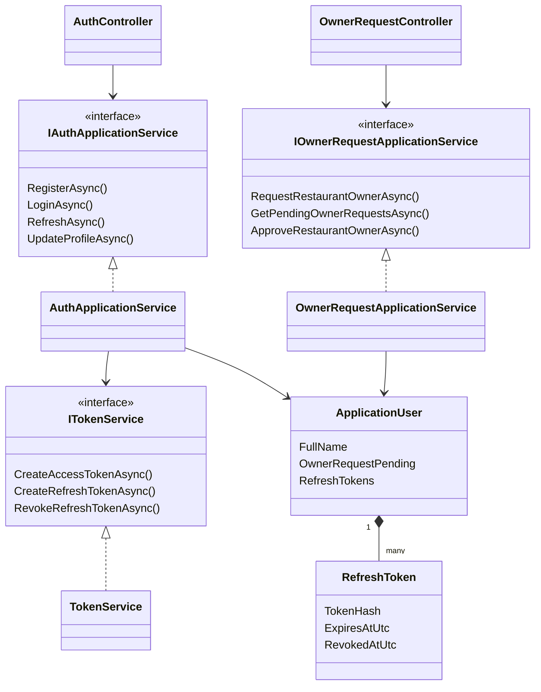
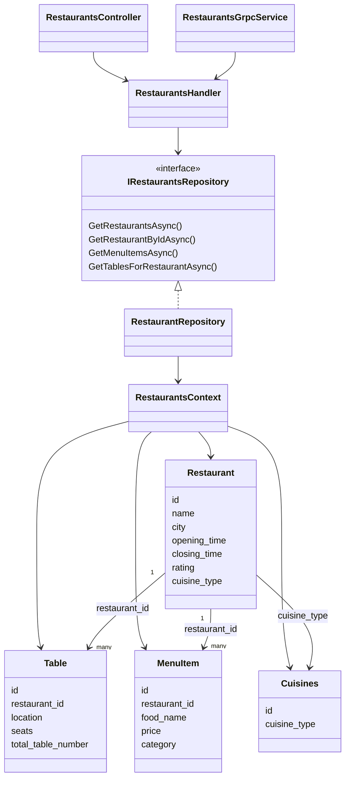
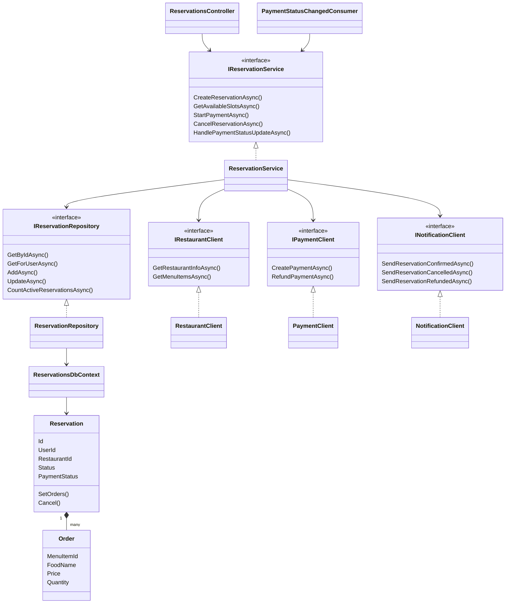
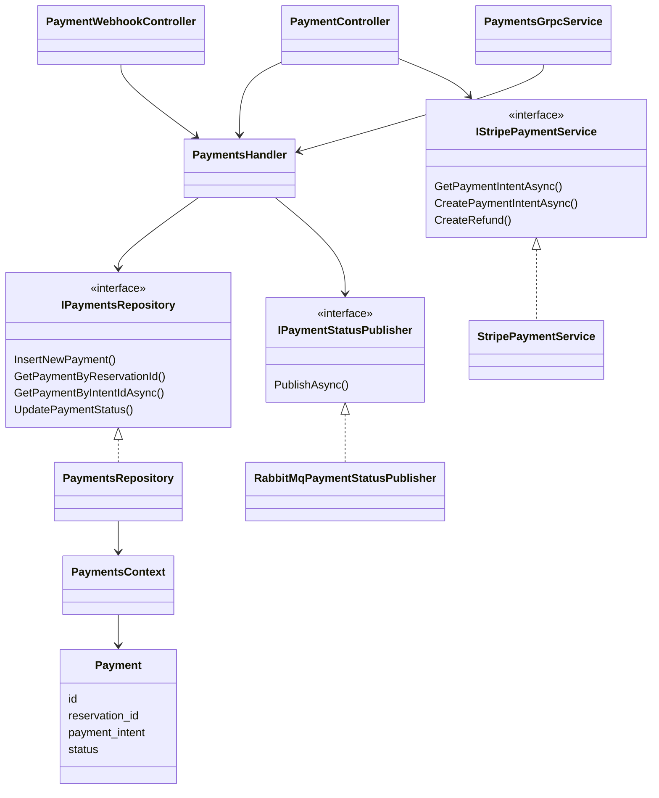
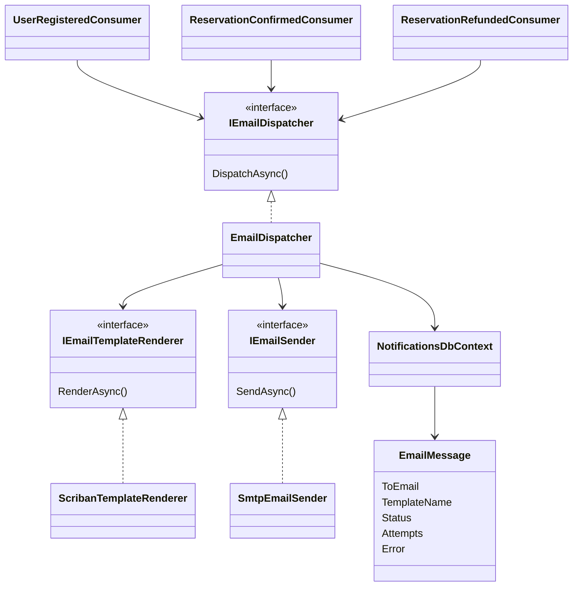
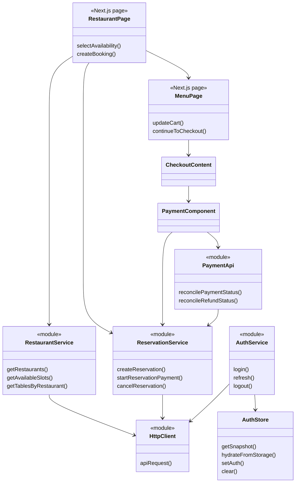
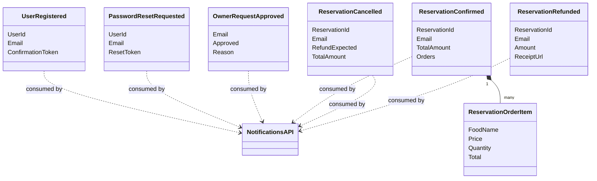

# Class Diagrams

These diagrams focus on the main classes and dependencies that explain each subsystem. Key members are shown for primary interfaces, domain entities, and integration contracts. Controllers, DbContext classes, and concrete adapters are represented by their names and relationships to keep the diagrams readable. DTO-only and framework-generated types are omitted.

[Identity](#identity-subsystem) · [Restaurants](#restaurants-subsystem) · [Reservations](#reservations-subsystem) · [Payment](#payment-subsystem) · [Notifications](#notifications-subsystem) · [Frontend](#frontend-subsystem) · [Contracts](#shared-integration-contracts)

## Identity subsystem

`AuthApplicationService` publishes registration and password-reset events. `OwnerRequestApplicationService` handles restaurant-owner requests and publishes `OwnerRequestApproved`.

## Restaurants subsystem

The REST controller and gRPC service share the same handler/repository boundary. Table and menu relationships are represented by IDs in the current entities.

## Reservations subsystem

Reservations is structured as API, Application, Domain and Infrastructure projects. The domain aggregate enforces reservation and payment-state transitions, while the application service coordinates external clients.

## Payment subsystem

`reservation_id` is the correlation key between Payment and Reservations. Stripe webhooks enter through `PaymentWebhookController` and `PaymentsHandler` converts provider events into logical statuses before publication.

## Notifications subsystem

`PasswordResetRequestedConsumer`, `OwnerRequestApprovedConsumer` and `ReservationCancelledConsumer` use the same dispatcher pipeline. The dispatcher creates an audit entry before delivery, then records `Sent` or `Failed`.

## Frontend subsystem

The frontend separates low-level API modules from service exports and page/components. `AuthStore` persists the current authentication snapshot in browser local storage, and the shared HTTP client adds the current access token to requests. Refresh-token rotation is exposed by `AuthService` rather than performed automatically by the HTTP client.

## Shared integration contracts

The contracts package contains data-only records and remains independent of service persistence. This reduces coupling while keeping producer and consumer payloads consistent.
